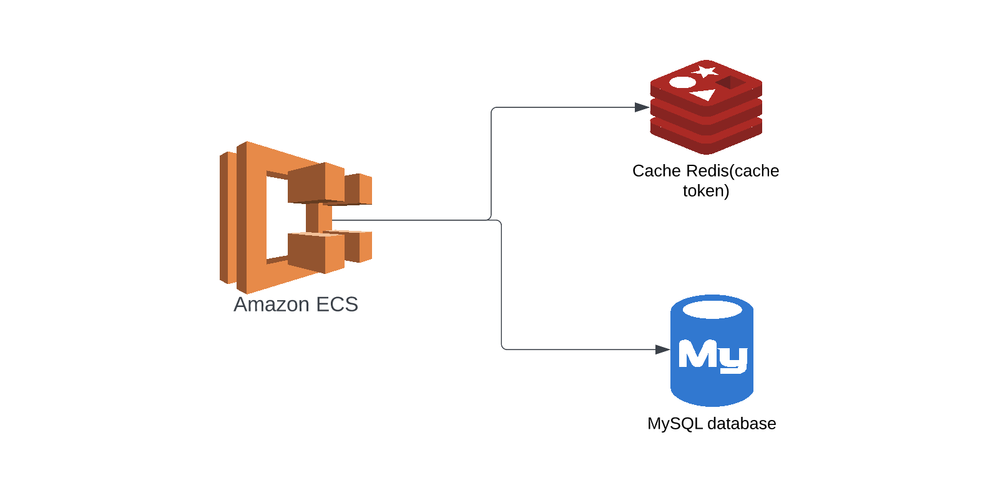
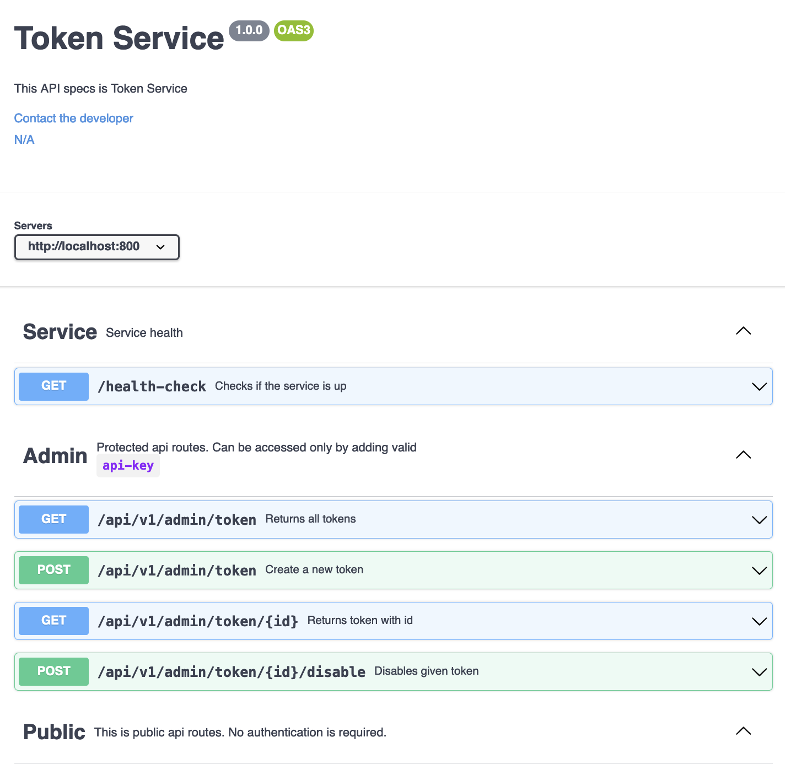

[](https://opensource.org/licenses/MIT)
[](https://github.com/shankar524/go-app-invite-service/actions/workflows/test.yml)
# go-app-invite-service
Go service to allow generating and validating token. Admin can generate tokens, list tokens and invalidating tokens. There is a public api(throttled) which allows checking if token is valid or not
This service allows generating invite token by admin. Invite token can validated.
Functionalities:
- For Admin:
  - Allows generating token(token cached in Redis)
  - Allows getting details of token
  - Allows listing tokens
  - Allows deactivating token
  - Requests are validated in admin routes(via api key validation)
- for Public
  - Allows validating token(done via redis)
  - Request throttled for public routes

## Design


## Folder structure
```bash
├── api
│   ├── controller
│   ├── repository
│   ├── routes
│   └── service
├── bootstrap
├── cron
├── docs
│   └── swagger.yaml
├── img
├── lib
├── main.go
├── makefile
├── middlewares
└── models
```

## Spinning up locally
- install [MySql](https://www.mysql.com/downloads/) Or run mysql docker image
  ```
  docker run \
    --detach \
    --name=mysql \
    --env="MYSQL_ROOT_PASSWORD=admin" \
    --env="MYSQL_USER=admin" \
    --env="MYSQL_PASSWORD=admin" \
    --env="MYSQL_DATABASE=test" \
    --publish 3306:3306 \
    mysql/mysql-server:latest
  ```
- install [Redis]() Or run Redis docker image
    ```
     docker run \
     -d --name redis \
     -p 6379:6379 \
     redis/redis-stack:latest
    ```
- setup `.env` file
  ```
  APP_PORT=8080
  DB_USERNAME=admin
  DB_PASSWORD=admin
  DB_PORT=3306
  DB_HOST=localhost
  DB_NAME=test
  REDIS_HOST=localhost
  REDIS_PORT=6379
  REDIS_PASSWORD=
  API_KEY=test
  API_RATE=10
  ```
- run app: `make run`

## API Authentication
Admin api have authentication. API key based authentication for these routes. Add `API_KEY` value in `.env` file and supply it as `api-key` header field of each admin request
```curl
curl --location --request GET '<endpoint>/api/v1/admin/token' \
--header 'api-key: <api_key>'
```

## API Documentation
API documentation is build with [swagger](https://swagger.io/). To run api documentation execute following command:
  ```
  make doc
  ```


